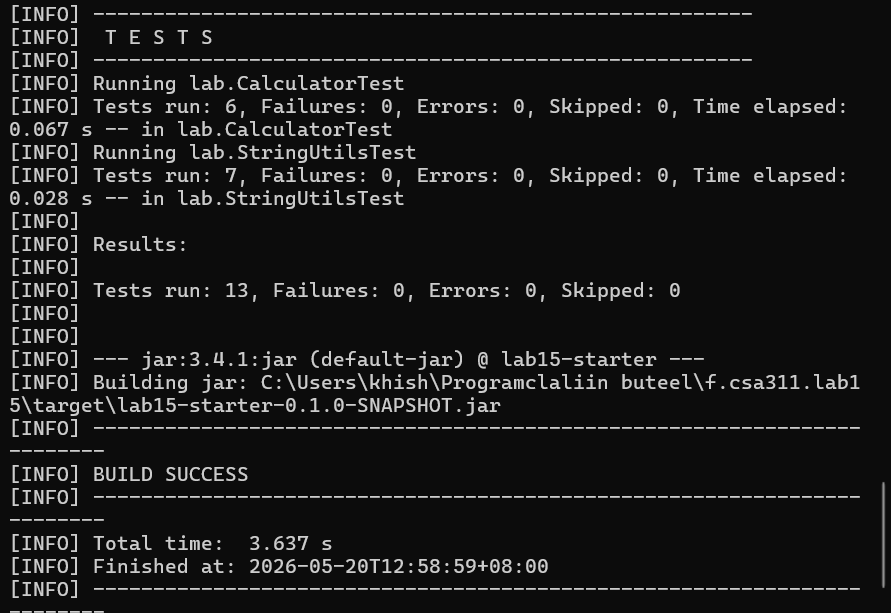
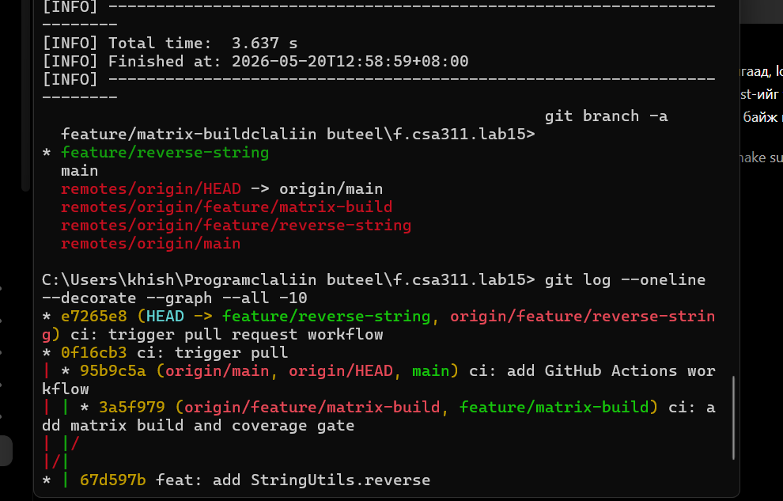
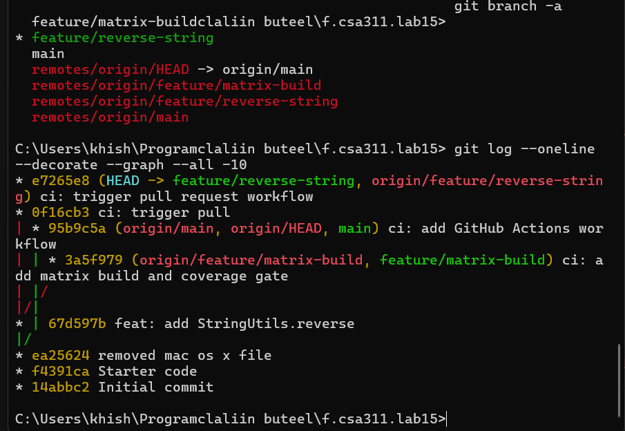
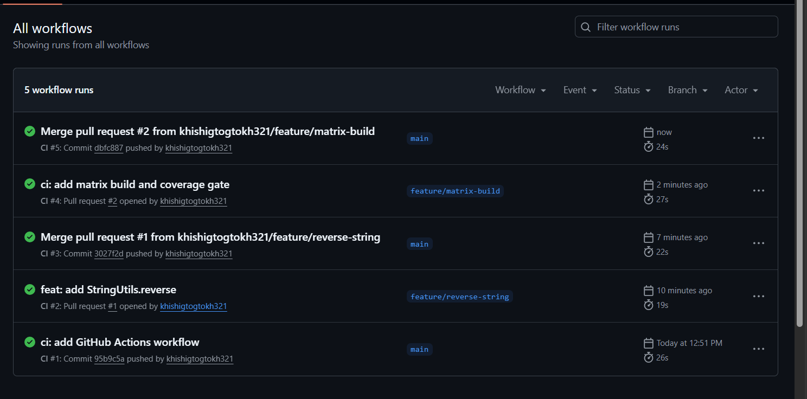
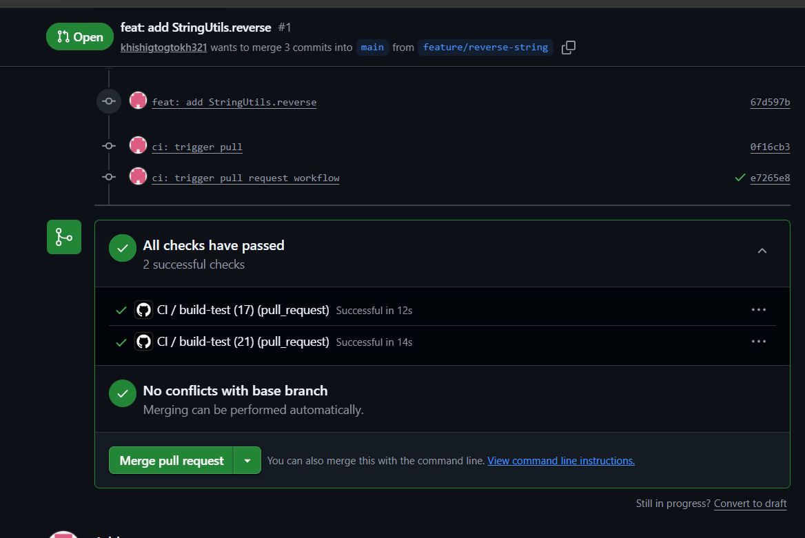
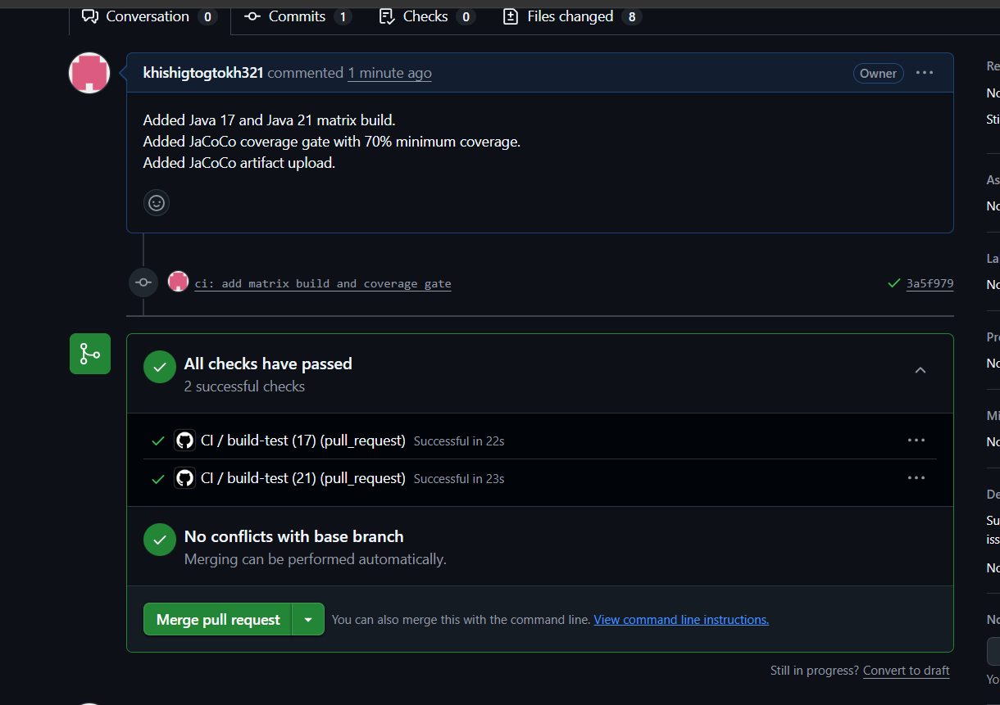
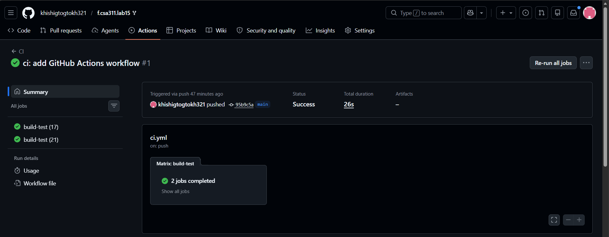

# Lab 15 - Git Workflow and CI/CD Report

## 1. Repository

- Repository: `https://github.com/khishigtogtokh321/f.csa311.lab15`
- Default branch: `main`
- Workflow name: `CI`
- Stack: Java, Maven, JUnit 5, GitHub Actions, JaCoCo

## 2. Local Verification

The project was verified locally with Maven. The test suite passed with 13 tests, 0 failures, and the build completed successfully.

## 3. Git Branch Workflow

The project uses `main` as the stable branch. Feature work was completed on separate branches and merged through pull requests.

- `feature/reverse-string` - added `StringUtils.reverse(String)` and unit tests.
- `feature/matrix-build` - added Java 17/21 matrix build, JaCoCo coverage gate, and artifact upload.

## 4. CI Workflow on GitHub Actions

The `CI` workflow runs automatically for pull requests and pushes to `main`. The workflow completed successfully on the feature branches and after merge commits.

## 5. Pull Request #1 - Reverse Feature

Pull Request #1 added the `StringUtils.reverse(String)` feature and related unit tests. Both required CI checks passed before merging.

## 6. Pull Request #2 - Matrix Build and Coverage Gate

Pull Request #2 added Java 17 and Java 21 matrix builds, the JaCoCo 70% coverage gate, and JaCoCo report artifact upload. Both matrix jobs passed.

## 7. Workflow on Main

The GitHub Actions workflow was added to the `main` branch and ran successfully with Java 17 and Java 21 jobs.

## 8. Branch Protection

The `main` branch must be protected with these settings:

- Require a pull request before merging
- Require 1 approval
- Require status checks to pass before merging
- Required checks: `build-test (17)`, `build-test (21)`
- Require linear history
- Do not allow bypassing the above settings

## 9. Direct Push Rejection

After branch protection was enabled, a direct push to `main` was tested and rejected by GitHub.

## 10. Peer Review

The pull request review includes at least two comments: one `[blocking]` comment and one `[nit]` comment, followed by a completed review from a collaborator.

## 11. Conclusion

This lab demonstrated trunk-based Git workflow with feature branches, pull requests, GitHub Actions CI, Java matrix builds, JaCoCo coverage enforcement, branch protection, and peer review. The most difficult part was enabling the workflow on `main` before pull request checks could run. The most useful part was seeing the same Maven build verified automatically on Java 17 and Java 21.
